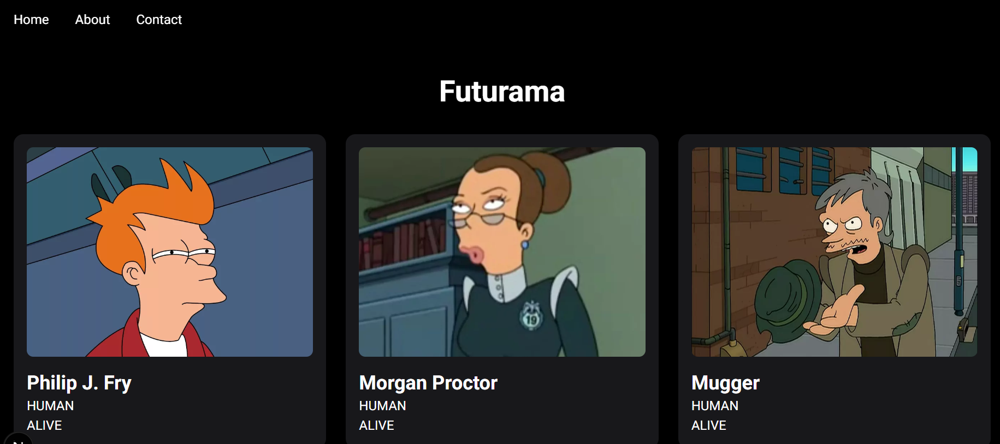

# Futurama API

Det här projektet är byggt med Next.js och använder ett REST API för att hämta data om Futurama-karaktärer.

## Syfte
Syftet med projektet är att lära mig:
- API-anrop med `fetch()`
- Dynamiska routes med `params`
- `searchParams` för att skicka parametrar i URL:en
- Felhantering med `response.ok`
- Visa data från ett API i en Next.js-applikation

## Funktioner
- Visar en lista med karaktärer.
- Hämtar en specifik karaktär med hjälp av id.
- Användaren kan bestämma hur många karaktärer som ska visas genom `limit` i URL:en.

## Tekniker
- Next.js
- TypeScript
- React
- REST API
## Screenshot

Futurama-webbapplikationen hämtar och visar karaktärsdata dynamiskt från ett externt REST API

  

